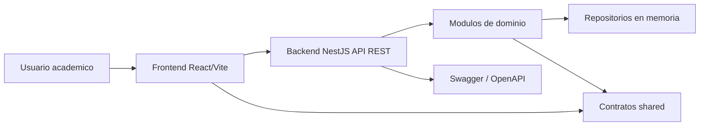

# Arquitectura de Fabrica de Software

Este documento describe la arquitectura base de `Courses Platform` para que un
equipo de fabrica de software pueda mantener, evolucionar y auditar el sistema
con criterios compartidos.

## Principios

- Separacion por aplicaciones: backend y frontend evolucionan de forma independiente.
- Contratos compartidos: las interfaces del dominio viven en `packages/shared`.
- Modulos por capacidad de negocio: estudiantes, docentes y cursos.
- Infraestructura reemplazable: los repositorios en memoria pueden sustituirse por persistencia real sin cambiar controladores.
- Convenciones explicitas: scripts, README, CI y backlog para que el equipo trabaje con el mismo mapa.

## Vista General



## Backend

El backend usa NestJS con una organizacion modular:

```text
src/
  common/
  modules/
    students/
    teachers/
    courses/
```

Cada modulo contiene:

- `*.controller.ts`: contrato HTTP.
- `*.service.ts`: reglas de aplicacion.
- `*.repository.ts`: acceso a datos.
- `dto/`: entrada/salida HTTP.

## Frontend

El frontend usa React con Vite:

```text
src/
  components/
  pages/
  services/
```

La UI consume la API y organiza la experiencia en paginas:

- `/`: dashboard ejecutivo de modulos.
- `/courses`: gestion y listado de cursos.
- `/students`: gestion y listado de estudiantes.
- `/teachers`: gestion y listado de docentes.
- `/{recurso}/{id}`: vista individual del registro.

## Contratos

`packages/shared` concentra interfaces TypeScript de dominio:

- `Student`
- `Teacher`
- `Course`
- `CreateStudentInput`
- `CreateTeacherInput`
- `CreateCourseInput`

Estos contratos reducen divergencias entre frontend y backend durante el
desarrollo. Para integraciones externas, el contrato oficial HTTP es Swagger.

## API y Documentacion

La API expone sus rutas bajo el prefijo `/api`. La documentacion interactiva esta
disponible en:

```text
http://localhost:3000/api/docs
```

El documento OpenAPI JSON esta disponible en:

```text
http://localhost:3000/api/docs-json
```

## Decisiones Arquitectonicas

| Decision | Estado | Justificacion |
| --- | --- | --- |
| Monorepo npm workspaces | Adoptada | Simplifica versionamiento local de frontend, backend y contratos. |
| NestJS modular | Adoptada | Permite separar capacidades por dominio. |
| Repositorios en memoria | Temporal | Acelera prototipo y deja aislada la persistencia futura. |
| Swagger/OpenAPI | Adoptada | Facilita contrato API, pruebas manuales y handoff a QA/integraciones. |
| React sin router externo | Temporal | Mantiene dependencias minimas; puede migrarse a React Router si crece. |

## Siguiente evolucion sugerida

1. Agregar base de datos PostgreSQL.
2. Integrar ORM.
3. Agregar autenticacion y roles.
4. Crear pruebas unitarias y e2e.
5. Definir pipeline de despliegue.
